# Práctica: Uso de Cluster y PM2 en Node.js

## 1. Introducción

En esta práctica se analiza el impacto del uso de **cluster** en aplicaciones Node.js intensivas en CPU, así como el uso del gestor de procesos **PM2** para mejorar la disponibilidad y el rendimiento. Para ello se implementa una API sencilla con y sin cluster, se somete a pruebas de carga con `loadtest` y se comparan los resultados obtenidos.

## 2. Preparación del entorno

Primero inicializamos el proyecto node.js e instalamos el framework Express mediante npm.

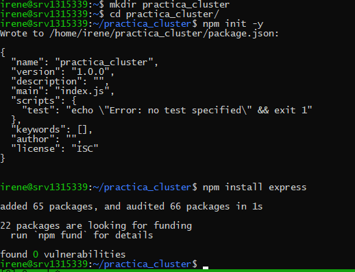

Creo el archivo `app_sin_cluster.js`, que implementa la aplicación Node.js sin uso de cluster.

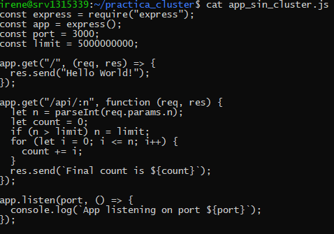

## 3. Aplicación sin cluster

Despliegue de la aplicación sin cluster utilizando el comando `node app_sin_cluster.js`.

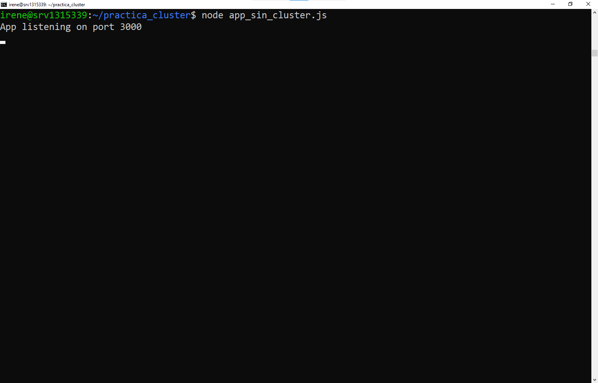

Acceso correcto a la ruta raíz (`/`) de la aplicación sin cluster desde el navegador.

Acceso a la ruta `/api/50`, comprobando el funcionamiento correcto del endpoint.

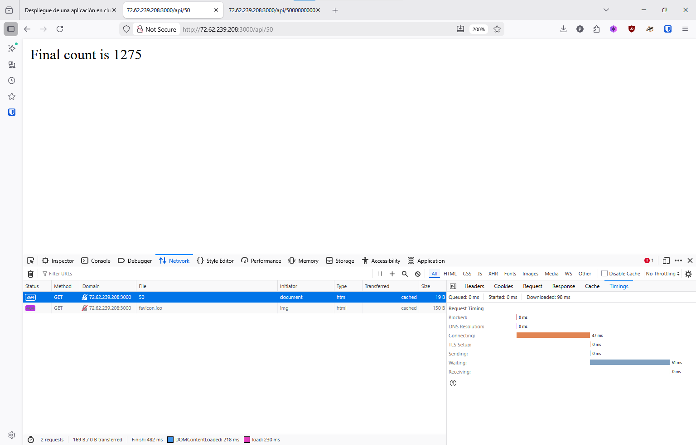

Acceso a la ruta `/api/50000000000` mostrando el tiempo de respuesta en la primera medición.

Segunda medición del tiempo de respuesta para la misma petición.

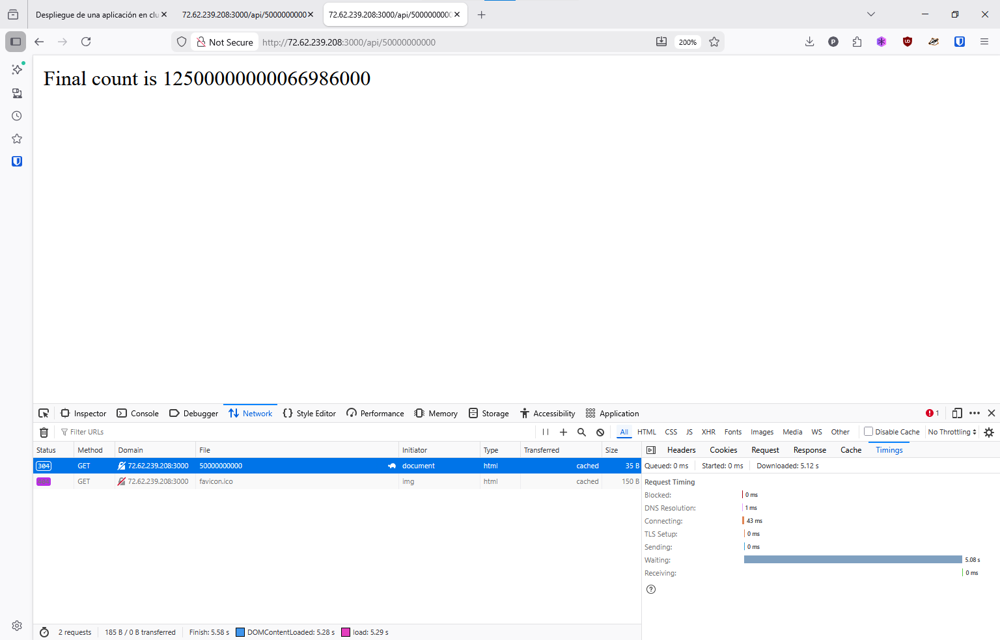

## 4. Aplicación con cluster

Despliegue de la aplicación con cluster, donde se crean múltiples workers según los núcleos de la CPU.

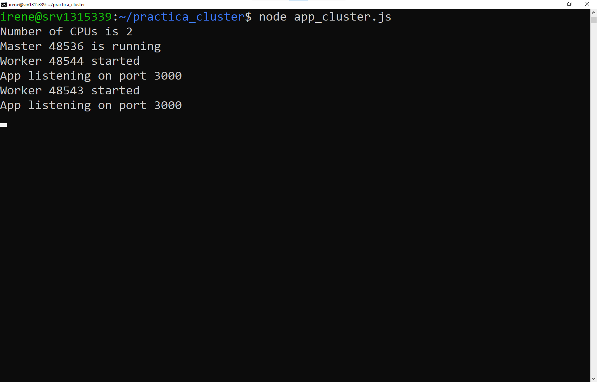

Primera medición del tiempo de respuesta accediendo a `/api/50000000000` con la aplicación en modo cluster.

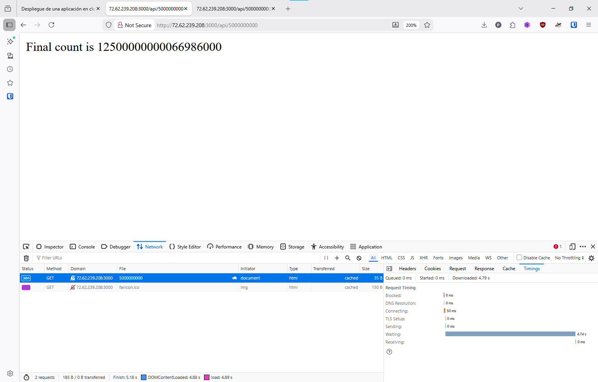

Segunda medición del tiempo de respuesta, observándose una mejora respecto a la versión sin cluster.

## 5. Pruebas de carga con Loadtest

Resultados de `loadtest` sobre la aplicación sin cluster, con una carga no tan grande.

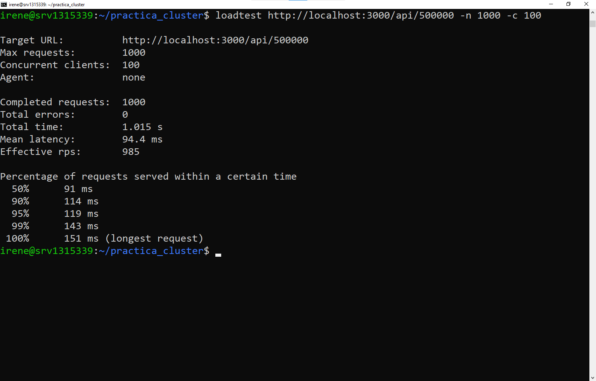

Resultados de `loadtest` sobre la aplicación sin cluster con una carga más grande.

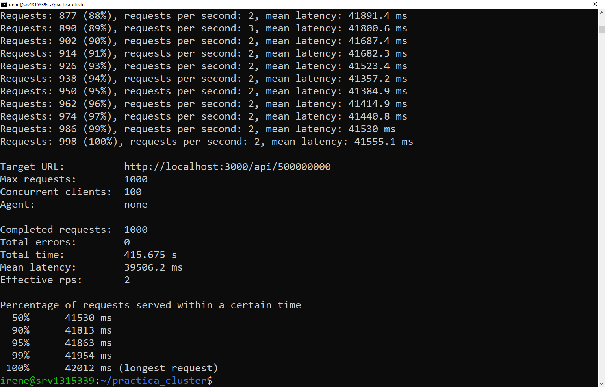

Resultados de `loadtest` sobre la aplicación, ahora con cluster y con una carga no tan grande.

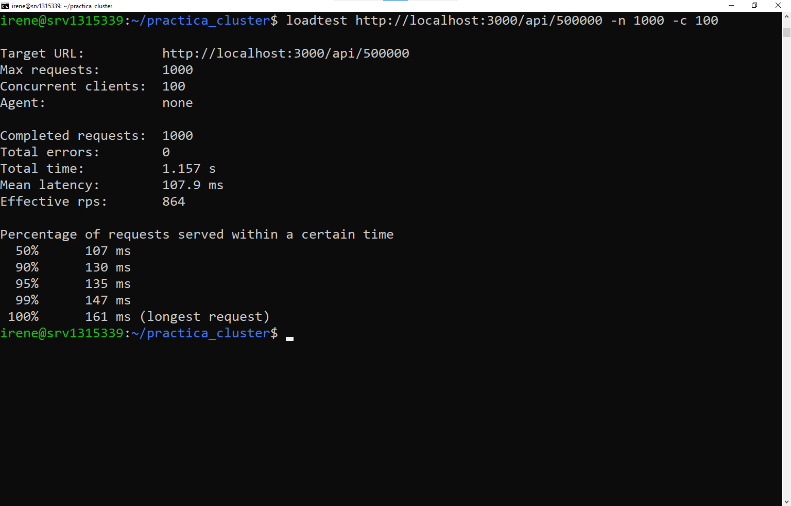

Resultados de `loadtest` sobre la aplicación, siguiendo con cluster y una carga más grande.

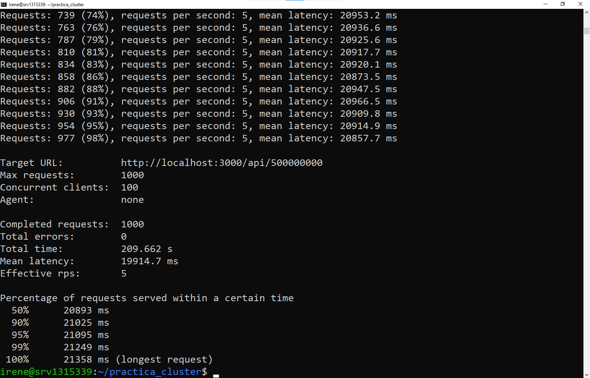

Los resultados muestran una reducción del tiempo total y de la latencia media al utilizar cluster, así como un incremento en las peticiones por segundo efectivas.

## 6. Gestión de la aplicación con PM2

Instalación del gestor de procesos PM2 de forma global.

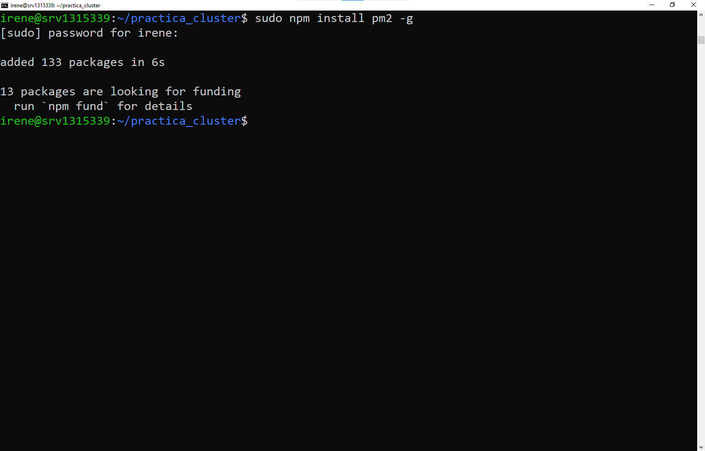

Ejecución de la aplicación sin cluster utilizando PM2 en modo cluster automático.

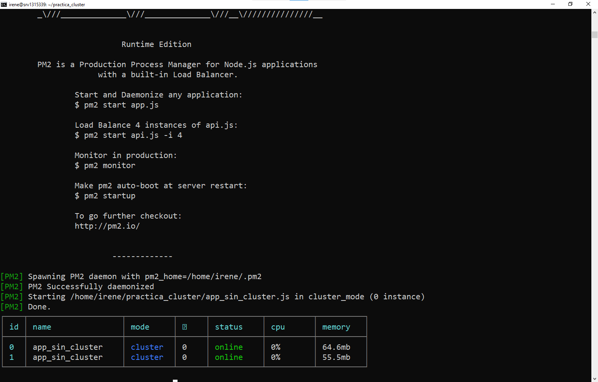

Definición del archivo `ecosystem.config.js` para configurar la ejecución en modo cluster.

Ejecución de la aplicación usando PM2 y el archivo de configuración.

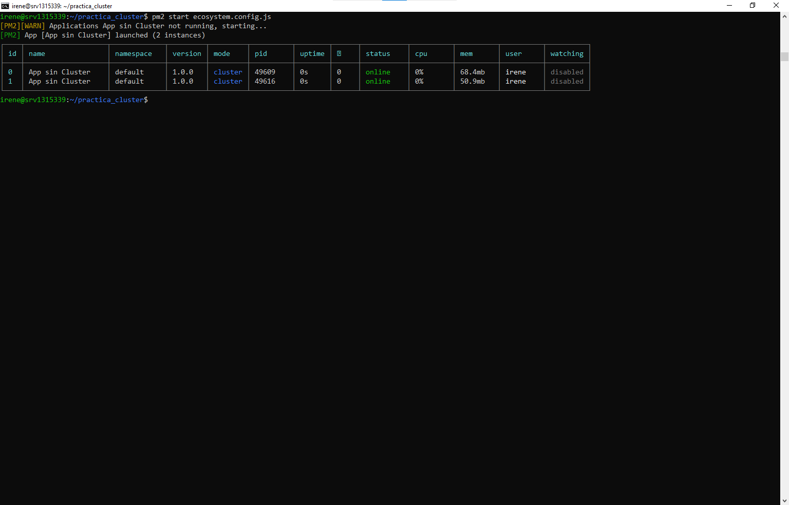

## 7. Explicación de comandos PM2

* **pm2 ls**: muestra el listado de procesos gestionados por PM2, indicando estado, consumo de CPU y memoria.

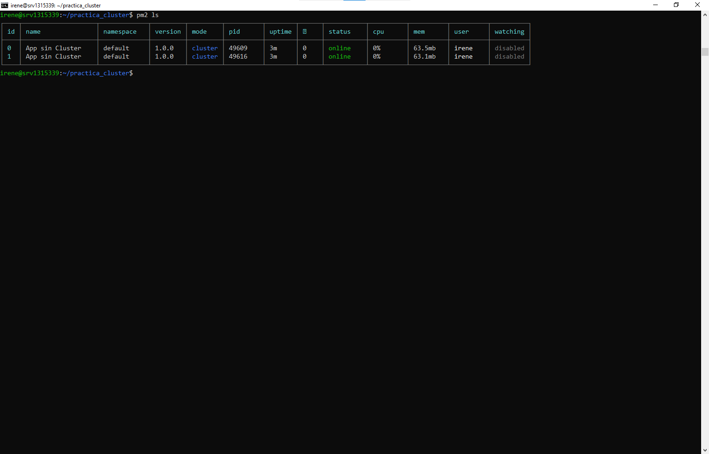

* **pm2 logs**: permite visualizar en tiempo real los registros de salida estándar y errores de las aplicaciones.

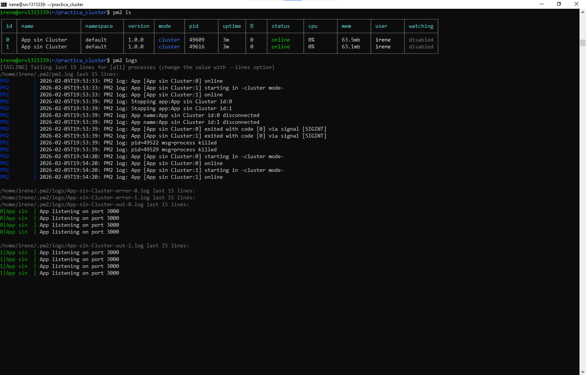
  
* **pm2 monit**: ofrece una interfaz interactiva para monitorizar el rendimiento de las aplicaciones.

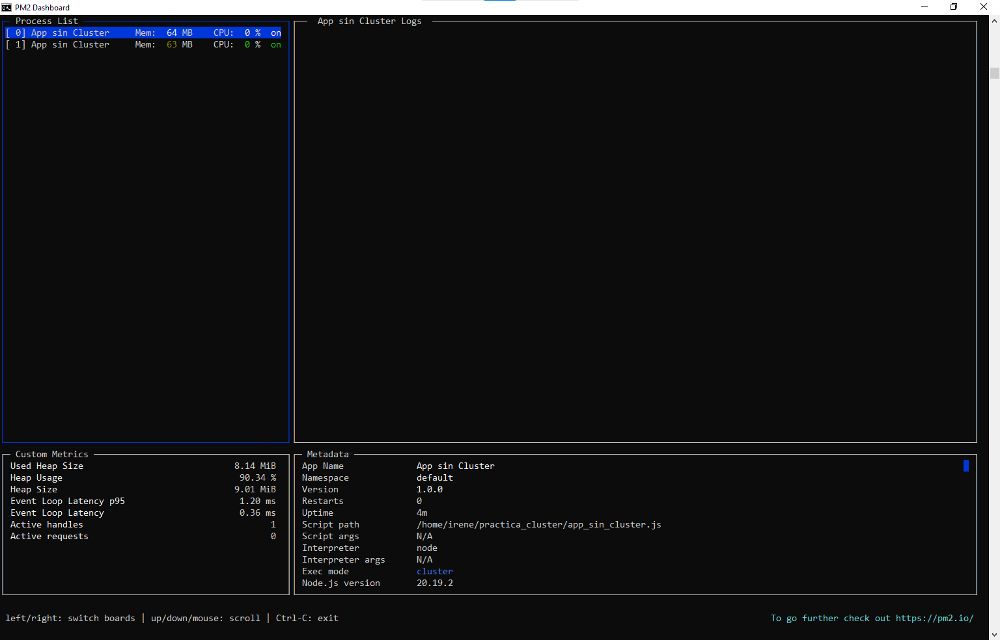

## 8. Discusión: ¿Por qué a veces la app sin cluster puede rendir mejor?

En las imágenes, se observa que cuando la carga de trabajo es muy baja o nula, la aplicación sin clúster responde ligeramente más rápido. Esto ocurre porque el proceso maestro del clúster actúa como un "intermediario" que debe recibir la conexión y decidir a qué trabajador (worker) enviársela. En un escenario en el que se hacen peticiones más pequeñas, la aplicación sin Cluster supera a la aplicación con Cluster ya que no tiene que gestionar todo lo relacionado con los procesos (creación, distribución de la carga, comunicación entre procesos, etc).
  
Además, el sistema operativo debe gestionar la memoria de varios procesos a la vez en el modo clúster. Si la tarea es tan simple que no llega a saturar un núcleo, tener otros 3 o 4 núcleos "encendidos" y vigilados por el maestro genera un gasto de recursos innecesario (overhead) que empeora las métricas frente a la sencillez de un solo hilo trabajando sin distracciones.
